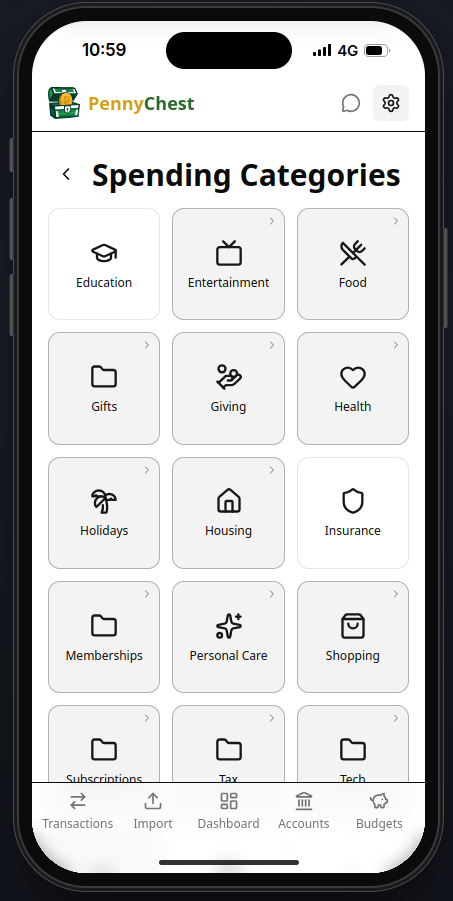
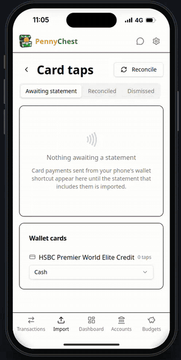

<p align="center">
  <br>
  
</p>

<p align="center">
  
  
  
  <a href="https://github.com/pennychest/pennychest/releases/latest"></a>
  
  
  <a href="https://pennychest.github.io"></a>
</p>

A self-hosted personal finance app with real double-entry accounting. Import bank statements, auto-categorise transactions, and review your spending - all in a modern web UI that you own and run yourself.

**Documentation: [pennychest.github.io](https://pennychest.github.io)**

<p align="center">
  
  
  
</p>

<p align="center">
  <br>
  An iPhone Wallet shortcut records each Apple Pay payment the moment you tap.
</p>

## Quick start

```bash
docker run -d -p 8000:8000 -v pennychest-data:/data ghcr.io/pennychest/pennychest:latest
```

Open **http://localhost:8000** and set a password straight away.

## Licence

MIT. See [LICENSE](LICENSE).
