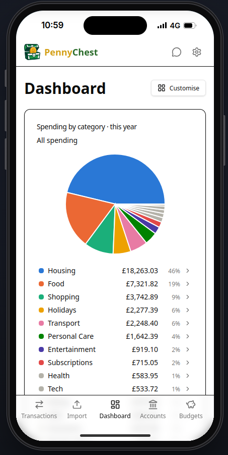
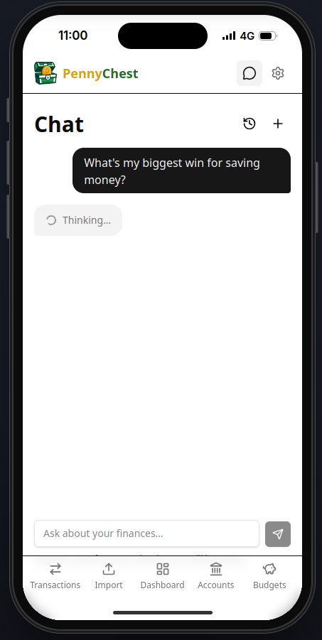

# PennyChest

PennyChest is a personal finance app you run yourself. Import your bank statements and it sorts every transaction into a category, shows where your money goes, and answers questions about it. Your data stays on your own server.

  
  
  
  

## Tech stack

- **Backend:** Python / FastAPI / SQLAlchemy / SQLite or PostgreSQL
- **Frontend:** React / TanStack Router / TanStack Query / shadcn/ui
- **Deployment:** a single Docker container, or Docker Compose

## Where next

- [Quick start](guide/quick-start.md) — run it in the cloud in one click
- [Installation](guide/installation.md) — the image, SQLite or PostgreSQL, and settings
- [Plugins](guide/plugins.md) — install importers and exporters from Settings, or make your own
- [Signing in](guide/signing-in.md) — first-run password and resetting it
- [Categorisation](guide/categorisation.md) — rules, learning from your history and AI, and how well they work together
- [Card taps](guide/card-taps.md) — record Apple Pay payments the moment you make them
- [AI integration](guide/ai-integration.md) — providers, automatic AI tasks and chat
- [AI agents (MCP)](guide/mcp.md) — connect Claude, ChatGPT and other assistants to your ledger
- [Local setup](guide/development.md) — the development stack
- [CI and deployment](guide/deployment.md) — tests, builds and releases

## Licence

MIT.
